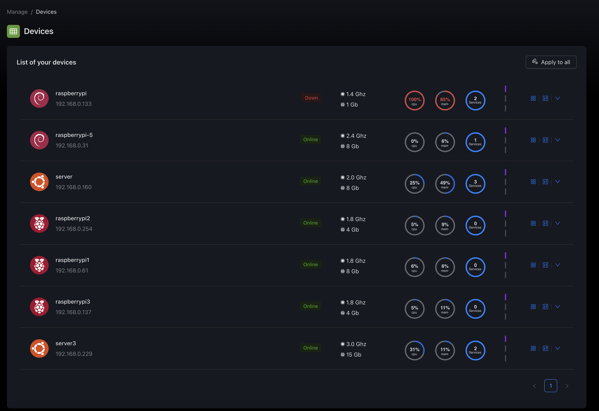
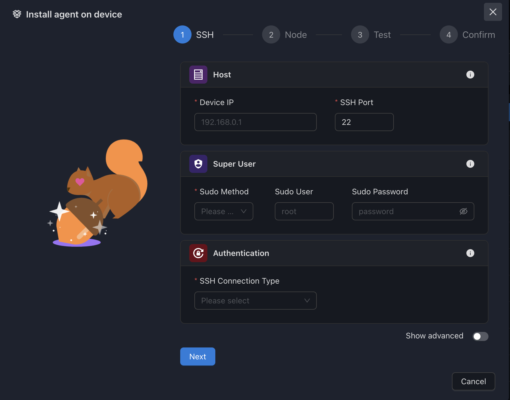

# SQUIRREL SERVERS MANAGER
https://squirrelserversmanager.io

[](https://github.com/SquirrelCorporation/SquirrelServersManager/actions/workflows/docker-publish.yml)
[](https://github.com/SquirrelCorporation/SquirrelServersManager/actions/workflows/node.js.yml)

NOTE:
This is a Alpha version, It may not work on your system. I am currently looking for testers and contributors.
Absolutely no warranties. 

See [QuickStart](https://squirrelserversmanager.io/docs/quickstart)

**Edit the .env file before anything**

## Production
```console
docker compose up
```

## Developement
```console
docker compose up -f docker-compose.dev.yml up 
```

## Troubleshoot
See [Troubleshoot](https://squirrelserversmanager.io/docs/technical-guide/troubleshoot)

## Main features:

|                                            | Features                               | Description                                                                                                                            |
|:------------------------------------------:|:---------------------------------------|:---------------------------------------------------------------------------------------------------------------------------------------|
|         | **Metrics & Statistics**               | :white_circle: Monitor the main metrics of your servers (CPU, RAM, etc.) and detect anomalies                                          |
| | **Playbooks management and execution** | :white_circle: Manage your playbooks, both locally and remotely, and run them on your devices                                          |
| )          | **Container Management**               | :white_circle: View all running containers, monitor their statistics, and receive alerts when updates are available                    |
| | **Automations**                        | :white_circle: Run actions on triggers like playbook execution or container actions                                                    |
|             | **Security**                           | :white_circle: We do our best to ensure your secrets and authentication info are secure using Ansible Vault and Bcrypt                 |
| | **Advanced configuration**             | :white_circle: SSM is user-friendly and easy to use, but it allows you to set up advanced options to fit your specific needs           |
| | **Integrations** (Coming soon)         | :white_circle: Trigger automations from other tools and call other services                                                            |
|      | **Collections**                        | :white_circle: Install open source services on your devices with one click                                                             |


## Screenshots





